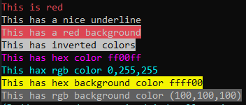

# NimColor

An easy to use module to print colors to the terminal.

This repo might see some back-end updates in the future due to this being a project for me to learn Nim, so it's not optimal nor pretty.
However, it is functioning.

## Examples


```nim
import nimcolor

echo "&red;This is red".color

echo "&underline;This has a nice underline".color

echo "&bgRed;This has a red background".color

echo "&invert;This has inverted colors".color

echo "&ff00ff;This has hex color ff00ff".color

echo "&0,255,255;This hax rgb color 0,255,255".color

echo "&bgffff00;&black;This has hex background color ffff00".color

echo "&bg100,100,100;This has rgb background color (100,100,100)".color
```


## Name defined colors

```
reset       darkBlue      darkBlue      bgDarkPurple   purple        bgPurple    
bold        darkPurple    darkPurple    bgDarkCyan     cyan          bgCyan
underline   darkCyan      darkCyan      bgWhite        brightWhite   bgBrightWhite        
invert      bgReset       bgReset       gray           bgGray
black       bgDarkRed     bgDarkRed     red            bgRed
darkRed     bgDarkGreen   bgDarkGreen   green          bgGreen
darkGreen   bgGold        bgGold        yellow         bgYellow
gold        bgDarkBlue    bgDarkBlue    blue           bgBlue
```

## Simple documentation

### Procs

All available procs for the nimcolor package.
___

#### color

Applies the color to the string. 

```nim
proc color*(raw:string, autoReset:bool=true): string

"&red;This is red".color == "\e[91mThis is red\e[0m"
"&red;This is red".color(autoReset=false) == "\e[91mThis is red"
```

if `autoReset` is true, it automatically adds a `&reset;` at the end of the string if set to true.
If this is not done, it'll apply the color values to every line that comes after it until reset or overwritten.

**Syntax**

Color uses color codes from either name defined colors, hex or rgb names.
The syntax is as follows: `&value;` where you replace `value` with a name, hex, or rgb (seperated with commas)

Any hex/rgb value can also be for the background by adding `bg` in front of it.

```nim
# Name Defined Color
"&red;"
"&blue;"
"&bgBlue;"

# Hex Colors
"&aAbBcC;"
"&112233;"
"&bgaAbBcC;"

# RGb colors
"&255,255,255;"
"&bg255,255,255;"
```

___
#### colorEscape

Escapes the color codes in the string, so the `color` proc doesn't colorify them anymore

```nim
proc colorEscape*(buf:string): string


"&red;Hello there".colorEscape == "&red:Hello there"
```
___
#### colorUnEscape

Unescapes the escaped string

```nim
proc colorUnEscape*(buf:string): string

"&red:Hello there".colorUnescape == "&red;Hello there
```
___
#### unColor

Removes the color from a string back into the color codes

```nim
proc unColor*(buf:string): string

"&red;Hello There".color != "&red;Hello There"
"&red;Hello There".color.unColor == "&red;Hello There&reset;"

# hex becomes rgb
"&ff0000;This is red".color.unColor == "&255,0,0;This is red&reset;"
```

**NOTE:** since hex color code is used like rgb in the back end, `unColor` decodes this to rgb.
___
#### removeColor

Completely removes any color from a string. 
Unlike unColor, this also removes the color codes.

```nim
proc removeColor*(buf:string):string = 

"&red;This is red".removeColor == "This is red"
"&red;This is red".color.removeColor == "This is red"
```

## Notes

This is made solely for myself, so some functionalities might not be included.

As well as this being tested on a windows device *only*, without any extensive cross platform functionality testing being done.
Which means this may or may not function as expected on your device.